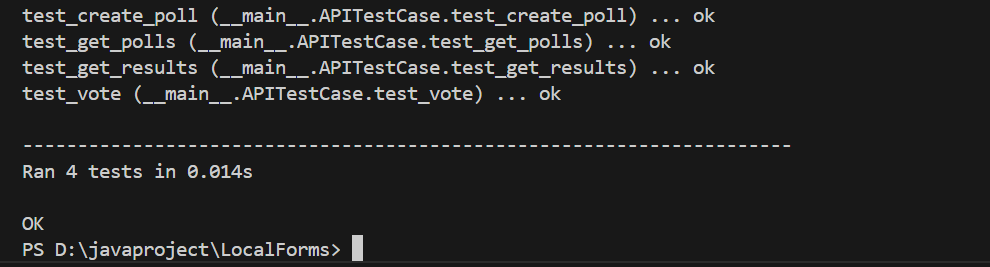

# ✅ Automated Unit Tests

This project includes a suite of **automated unit tests** for the backend API using Python's built-in `unittest` framework.

The tests verify that all main API endpoints work as expected:

---

## 🔧 Tested Endpoints

- `GET /api/polls` — fetches all available polls
- `POST /api/polls` — creates a new poll
- `POST /api/vote/<id>` — submits votes for a selected poll
- `GET /api/results/<id>` — retrieves results for a specific poll

---

## 🔍 Test Summary

The following tests are defined in `test_app.py`:

- `test_get_polls()` — Checks that polls are returned as a list and status is 200.
- `test_create_poll()` — Verifies that a new poll can be created successfully.
- `test_vote()` — Sends a vote and expects a 200 OK response.
- `test_get_results()` — Fetches poll results and checks if title exists in the response.

---

## 📸 Example Output

After running `python test_app.py`, the console shows:

_All tests passed successfully._